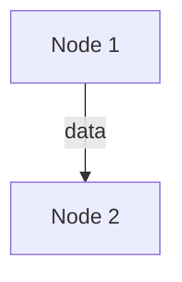

# Agent Graph: <name>

## Root outcome

- Desired outcome:
- Decision authority:
- Outside the graph:
- Frozen rules:
- Assumptions:

## Reality anchors

| ID | Fact settled | Evidence and provenance | Freshness | Interpreter |
|---|---|---|---|---|
| A1 |  |  |  |  |

## Nodes

| ID | Responsibility | Owner | Executor (model/context/tools) | Inputs | Outputs | Authority | Containment | Trigger/cadence | Observable success | Observable failure | Max retries | Terminal state |
|---|---|---|---|---|---|---|---|---|---|---|---|---|
| N1 |  |  |  |  |  |  |  |  |  |  |  | done/stopped/rolled-back/escalated |

## Edges

| From | To | Type | Trigger | Payload | Failure behavior |
|---|---|---|---|---|---|
| N1 | N2 | data/control/handoff/veto/rollback/escalation |  |  |  |

## Bounded loops

| Loop | Objective | Proxy metric | Counter-metric | Target owner | Maximum attempts | Exit states |
|---|---|---|---|---|---|---|
| L1 |  |  |  |  |  | done/stopped/rolled-back/escalated |

## Arbitration and recovery

- Conflicting decisions and arbiter:
- Anchor-backed dissent resolver and record:
- Scarce resources, allocator, and per-node request budget:
- Checkpoint and rollback trigger:
- Human escalation boundary:
- Interruption/resume state:

## Failure challenges

Every case in the skill's topology challenge belongs here. The rows below are
the starting set, not the whole list.

| Scenario | Detecting node | Decisive anchor | Allowed response | Terminal state | Residual risk |
|---|---|---|---|---|---|
| Metric improves while outcome worsens |  |  |  |  |  |
| Verification becomes circular |  |  |  |  |  |
| Measurement becomes stale |  |  |  |  |  |
| Same repair fails twice |  |  |  |  |  |
| Reviewer and implementer share the same blind spot |  |  |  |  |  |
| Nodes converge on the same choice or name |  |  |  |  |  |
| Nodes contend for one scarce resource |  |  |  |  |  |
| Consensus forms before the decisive evidence |  |  |  |  |  |
| A node acts on a peer's workspace, processes, or credentials |  |  |  |  |  |

## Minimality check

- Nodes removed or combined:
- Nodes sharing one executor and context:
- Agent nodes replaced by deterministic checks:
- Every remaining node's unique value:
- Every cycle's bound and terminal state:

## Execution mapping

Include only when implementation is requested.

